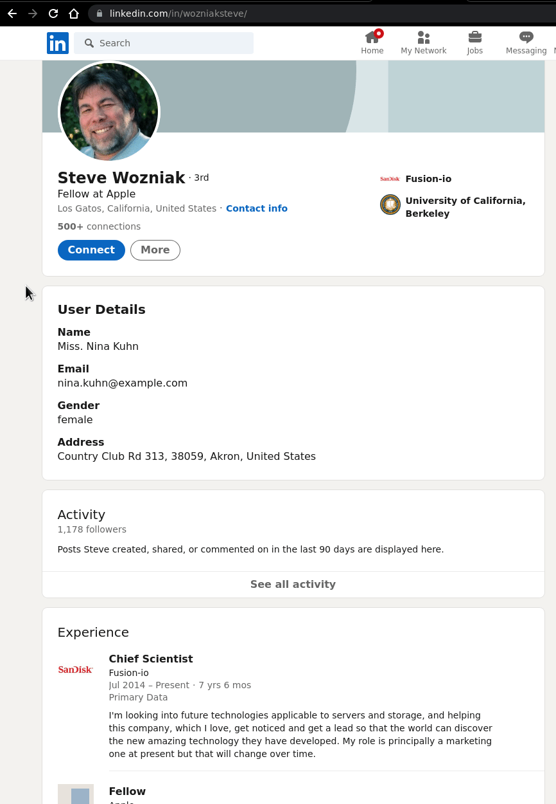

## Description

This is a very basic chrome extension which works on Linkedin user profile pages and display a card with random user data from an API.

## Install

Go to ```chrome://extension``` and *Load unpacked* the folder with the ```manifest.json``` file.


## Usage

Go to any Linkedin profile (e.g. https://www.linkedin.com/in/uygaruyaniksoy/), if the extension is active there should be a new card displaying below the main info card.

